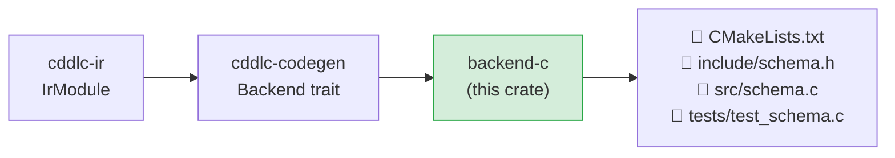
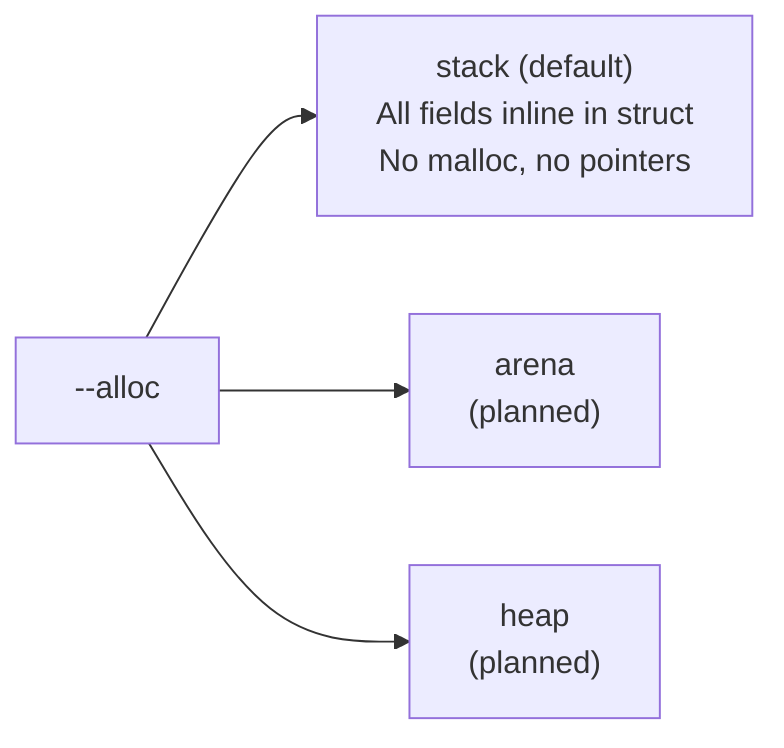

# backend-c

Generates a complete ANSI C library — `CMakeLists.txt`, a public header (`.h`), an
implementation file (`.c`), and a Unity-based test suite — from an `IrModule`.  The generated
code targets embedded and resource-constrained systems with configurable allocation strategies.

## Position in the pipeline



## Generated output layout

```
<output>/
  CMakeLists.txt           # CMake build definition, fetches the CBOR runtime
  include/
    <module>.h             # typedefs, structs, enums, function prototypes
  src/
    <module>.c             # encode/decode implementations
  tests/
    test_<module>.c        # Unity framework roundtrip tests
```

## Runtime options (`--runtime`)

| Runtime | Notes |
|---|---|
| `nanocbor` (default) | Tiny CBOR encoder/decoder; minimal memory footprint |
| `tinycbor` | Intel's tinycbor; widely used in IoT firmware |
| `zcbor` | Nordic Semiconductor's zcbor; strict RFC 8949 compliance |

The generated `CMakeLists.txt` fetches the selected runtime via `FetchContent`.

## What is generated per IR type

### Structs

```c
/* include/<module>.h */
typedef struct {
    char     id[64];           /* tstr field — fixed-size char array */
    bool     active;
    bool     has_label;        /* presence flag for optional field */
    char     label[128];
} Device;

int device_encode(const Device *s, uint8_t *buf, size_t buf_len, size_t *out_len);
int device_decode(const uint8_t *buf, size_t buf_len, Device *out);
```

- Strings are fixed-size `char[]` arrays sized from `@str-capacity` or `--max-str`.
- Optional fields use a `bool has_<field>` presence flag.
- Integer map keys are used directly as CBOR integer constants.

### Enums

```c
typedef enum { STATUS_OK, STATUS_WARN, STATUS_ERROR } Status;
int status_encode(Status v, uint8_t *buf, size_t buf_len, size_t *out_len);
int status_decode(const uint8_t *buf, size_t buf_len, Status *out);
```

String enums decode by comparing the CBOR text value; integer enums decode by numeric match.

### Arrays

```c
typedef struct {
    float    items[16];        /* capacity from @capacity or --max-array */
    uint32_t count;
} Readings;
```

### Aliases

```c
typedef char DeviceId[16];    /* .size constraint → fixed-length array */
```

## Allocation strategy (`--alloc`)

All arrays and strings are statically sized at compile time.  No dynamic allocation occurs
in the generated code — every buffer is either an inline array or a caller-supplied pointer.



## Constraint validation

```c
/* .size 16 on a tstr field */
assert(strlen(s->device_id) == 16);

/* .range (0..100) on a uint field */
assert(s->value >= 0 && s->value <= 100);
```

A `@regex-hook name` pragma causes the generated code to call `name(field_ptr, field_len)`;
the implementation must be supplied by the user.

## dCBOR support

When `--dcbor` is set, map-entry writes are sorted by key before encoding, producing
canonical deterministic CBOR output per RFC 8949 §4.2.

## Build the generated code

```bash
cd <output>/
mkdir build && cd build
cmake .. -DCMAKE_BUILD_TYPE=Release
make
ctest --output-on-failure    # runs Unity tests
```

## Known gaps and future enhancements

- **JSON mode not available**: the C backend generates CBOR only.  A JSON mode using
  cJSON or jsmn would serve REST-oriented firmware.
- **`arena` and `heap` allocation**: only `stack` is fully implemented; other strategies
  fall back to stack-style code.
- **No cross-platform CMake presets**: no presets for common embedded toolchains
  (ARM GCC, LLVM Embedded).
- **Partial constraint validation**: `.regexp` requires a user-supplied `@regex-hook`;
  inline validation is not emitted.
- **No `@doc` comment emission**: doc pragmas are not rendered as C header comments.
- **Unity version pinning**: the CMake file uses a fixed Unity test framework version.

## License

MIT OR Apache-2.0
